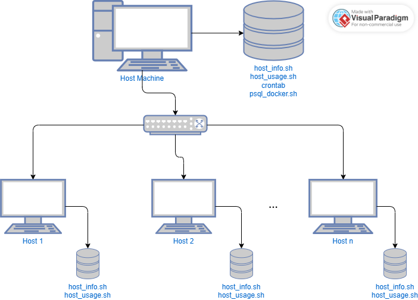

# Linux Cluster Monitoring Agent

# Introduction
The purpose of this project is to design an automated linux monitoring agent that collects and records system hardware specifications
and resource usage data of those systems. The idea is for the end user to have a simple way of checking the hardware usage (i.e. CPU data, memory and disk usage) of their host machine. 
The data that is collected is stored in a central PostgreSQL database. 

This tool may be useful for system administrators, DevOps teams and IT Operations and Support teams to check system usage and identify problems within their host machines much more quickly.

This Linux Clustering tool uses `bash` scripts, `Docker` for the PostgreSQL image and container, `psql` for the central database, and `crontab` for automation of the host data being displayed.

# Usage
```bash
# Start a PostgreSQL Container:
./scripts/psql_docker.sh start

# Create the PSQL Database Tables:
psql -h localhost -U [db_username] -d host_agent -f ./sql/ddl.sql

# Enter hardware info data (will only be entered once):
bash ./scripts/host_info.sh localhost 5432 host_agent [db_username] [db_password]

# Enter hardware usage data (shows most recent entry):
bash scripts/host_usage.sh localhost 5432 host_agent [db_username] [db_password]

# Set up crontab (automated to show usage data every minute):
  a. bash. crontab -e
  
  # Enter this line into crontab:
  b. * * * * * bash /home/rocky/dev/jarvis_data_eng_[FirstNameLastName]/linux_sql/scripts/host_usage.sh localhost 5432 host_agent [db_username] [db_password] > /tmp/host_usage.log

# To check a single database entry:
cat /tmp/host_usage.log
```

# Implementation
The project was implemented with bash scripts, a PSQL docker container and image, the PSQL database and crontab.
## Architecture


## Scripts

- `host_info.sh`: Ran once by each host within the Linux Cluster to get host machine hardware specifics.
- `host_usage.sh`: Ran each minute to show updated host usage data at each entry.
- `psql_docker.sh`: It is a script that starts, stops or creates a PostgreSQL `docker` container to store the data collected from each host.
- `ddl.sql`: An SQL script that sets up the `host_info` and `host_usage` tables in the database called `host_agent` for eventual data collection.

## Database Modelling

The `host_agent` database stores the entries in the `host_info` and `host_usage` tables. 
`host_info` stores hardware specifications of the system.
`host_usage` stores the usage of data by the system.

Here are the `host_info` fields:

- `id`: A unique ID corresponding to each host, automatically increments
- `hostname`: The domain name of the host machine
- `cpu_number`: Number of CPUs
- `cpu_architecture`: CPU Architecture
- `cpu_model`: CPU Model
- `cpu_mhz`: CPU clock speed in MHz (Megahertz)
- `l2_cache`: Size of L2 cache in MB
- `timestamp`: The time that data was recorded
- `total_mem`: Total memory in KB

Here are the `host_usage` fields:

- `timestamp`: The time that usage data was recorded
- `host_id`: ID related to the host within `host_info` table
- `memory_free`: Available memory in MB
- `cpu_idle`: Percentage of CPU in idle mode
- `cpu_kernel`: Percentage of CPU in kernel mode
- `disk_io`: Disk I/O activity (number of read/write operations)
- `disk_available`: Available disk space in MB

# Testing
To see if the Linux monitoring agent was working as intended, 
the files `psql_docker.sh`, `ddl.sql`, `host_info.sh` and `host_usage.sh` were to be tested.

### `psql_docker.sh`: 
Firstly, after the PSQL docker container was set up, 
the `psql_docker.sh` script commands needed to be tested to make sure that the container commands for the start, stop and create conditions were working as intended.
This was done with debugging statements at each of the conditions. 
Certain `echo` test statements were to show up for `start` and `stop` while another `echo` statement would show when the `create` command was used.

### `ddl.sql`:
The SQL file was tested in the PSQL CLI to see if the tables `host_info` and `host_usage` were properly being created.
To see if entries could be stored within the tables, SQL queries to insert sample data were used.

### `host_info.sh`:
To ensure that this script was entering the static hardware information, 
the bash command was tested in the terminal to see. 
The `bash -x` command was used to check if all variable fields were being entered
and `echo` statements in the script were written to check if data was extracted from the system correctly.

### `host_usage.sh`:
This script was tested by running the bash command to check if usage data was being collected as intended.
The `bash -x` command was used to check if all variable fields were being entered
and `echo` statements in the script were written to check if data was extracted from the system correctly.

# Deployment
The monitoring agent was automated and deployed using `docker` for container setup and use,
`crontab` for automating usage data collection, 
and `GitHub` for uploading changes to the project periodically.

The `crontab` schedules system usage data entry from `host_usage.sh` each minute.

# Improvements
1. Web UI: A Web-based user interface can be created for users to easily see usage data in a more visually appealing way.
2. Track more metrics: Perhaps the monitoring agent can also track network bandwidth, latency or historical trends of usage data.
3. Secure Communication: Ensure secure communication of data with security frameworks such as Transport Layer Security (TLS).
